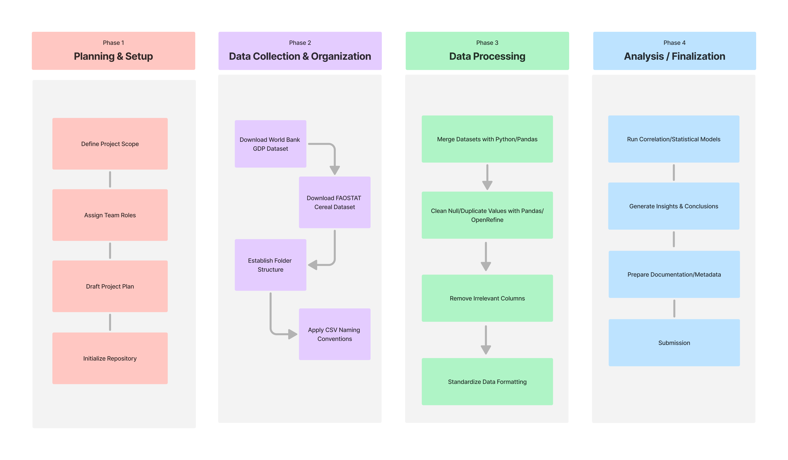

# IS 477 Milestone 3: Status Report 📝

### 📋 Task Updates

#### Week 1 - Project Setup and Planning
During Week 1, we completed the initial setup of the project. This included establishing the GitHub repository, outlining the project scope, assigning team roles, discussing about the project topic.

Artifacts:
- `/README.md`

#### Week 2 - Data Collection and Acquisition
During Week 2, we downloaded the datasets used for our project, including the World Bank GDP per capita dataset and the FAOSTAT cereal production dataset. We also reviewed dataset formatting and developing our project plan.

Artifacts:
- `/data/raw/API_NY.GDP.PCAP.CD_DS2_en_csv_v2_245 copy.csv`
- `/data/raw/FAOSTAT_data_en_4-14-2026 copy.csv`
- `/ProjectPlan.md`

#### Week 3 - Data Storage and Organization

During Week 3, we organized the repository structure by creating designated folders for raw data, processed data, notebooks, and documentation. We also implemented CSV naming conventions and standardized file storage organization for clarity and reproducibility.

Artifacts:
```text
project-repo/
│
├── data/
│   ├── raw/              # Original untouched datasets
│   └── processed/        # Cleaned/merged datasets
│
├── notebooks/            # Jupyter notebooks
│
├── docs/                 # Reports / workflow diagrams / screenshots
│
├── analysis/             # Exported visuals / final graphs / findings
│
├── README.md
├── ProjectPlan.md
└── StatusReport.md
```


#### Week 4 - Data Integration (In Progress)
Currently, during Week 4, we are merging the FAOSTAT and World Bank datasets using Python and Pandas. We are matching the datasets based on shared country and year identifiers while resolving inconsistencies in formatting and naming conventions.

#### Week 5 – Data Cleaning
We plan to clean the integrated dataset by handling null values, duplicate rows, and removing unnecessary columns not relevant to our analysis, using Python/Pandas and OpenRefine.

#### Week 6 – Statistical Analysis
We plan to perform correlation and regression analyses to evaluate the relationship between cereal production and GDP per capita.

#### Week 7 – Documentation and Metadata
We will prepare final documentation including markdown reports, metadata descriptions, and reproducibility instructions.

#### Week 8 – Final Submission
We will finalize repository cleanup, finalize all reports, and submit the completed project.

### 📅 Timeline Status
We have been working on tasks during Weeks 1-3 of our project. Week 1 was the project setup, which included project planning, initializing the repository, and defining team roles. Week 2 was downloading our datasets for the project, which are the World Bank GDP data and FAOSTAT cereal datasets. We also drafted and edited our project plan according to our personal schedules and ongoing priorities. Week 3 consisted of establishing folder format within the repository, as well as implementing CSV naming conventions and storage scripts. This week, Week 4, we are working on Merging the FAOSTAT and World Bank datasets using Python and Pandas. Our remaining timeline is for Weeks 5-8. For Week 5, we plan to focus on data cleaning, which will include handling null and duplicate values, as well as columns in the datasets not related to oue analysis. During Week 6, our goal is to get into the actual analysis part of the project. This will be running different models to test correlations between cereal production and GDP and generate valuable insights/conclusions from the analysis. In Week 7, we will work on the documentation and Metadata of our project. For this, we will finalize Markdown reports, technical metadata, and reproducibility instructions. Finally, Week 8 will be our final submission week, where we will work on repository cleanup, final presentation preparations, and project submission. The project will be finalized and submitted by May 3rd.

### 🔄 Project Plan Changes

### ⚠️ Challenges & Problems

### 👥 Team Contributions
